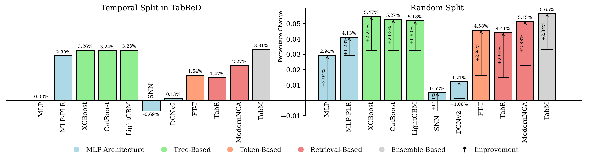
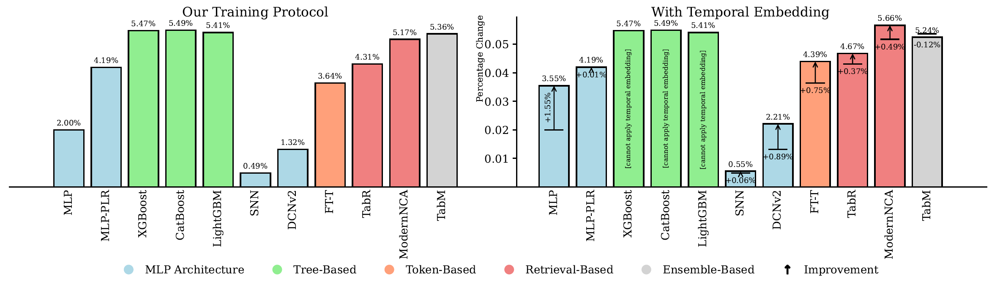
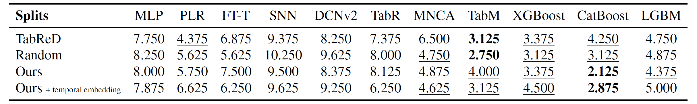
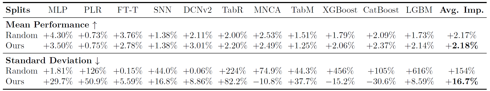
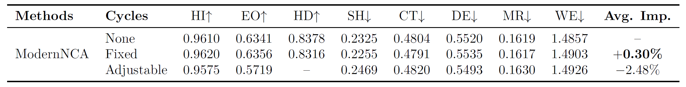
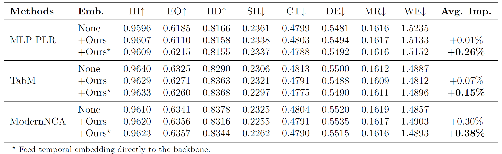
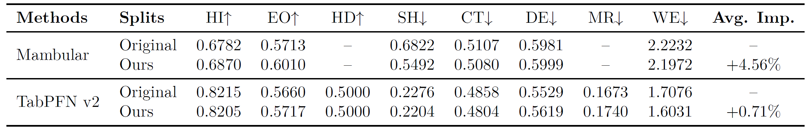

# Understanding the Limits of Deep Tabular Methods with Temporal Shift

This [paper](https://arxiv.org/abs/2502.20260) is accepted by **ICML'25**. 🎉

## Usage Instructions

### Deep method

For deep methods, run:

```bash
python train_model_deep.py --dataset $DATASET_NAME \
                           --enable_timestamp \
                           --validate_option $VAL_OPTION \
                           --model_type $MODEL_NAME \
                           --cat_policy $CAT_POLICY \
                           --temporal_policy $TEMPORAL_POLICY \
                           --gpu 0 --max_epoch 200 --seed_num 15 \
                           --tune --retune --n_trials 100
```

- `DATASET_NAME`: Dataset name in TabReD benchmark.

  ```bash
  choices=(cooking-time, delivery-eta, ecom-offers, homecredit-default,
           homesite-insurance, maps-routing, sberbank-housing, weather)
  ```

- `VAL_OPTION`: Validation set splitting strategy. Random splits are fixed in `data_splits/`.

  ```bash
  choices=(
      holdout_last,                             # Original splitting strategy in TabReD
      holdout_foremost_sample,                  # Our training protocol
      holdout_last_nobias_lag_sample,           # Split (a), w/  lag, w/o bias
      holdout_last_nobias_nolag_sample,         # Split (b), w/o lag, w/o bias
      holdout_last_bias_lag_sample,             # Split (c), w/  lag, w/  bias
      holdout_last_nobias_nolag_reverse_sample, # Split (d), w/o lag, w/o bias
      holdout_random_0,                         # Random split 0
      holdout_random_1,                         # Random split 1
      holdout_random_2,                         # Random split 2
  )
  ```

- `MODEL_NAME`: Deep method name. `*_temporal ` means model with our temporal embedding.

  ```bash
  choices=(
      mlp,       mlp_temporal,
      mlp_plr,   mlp_plr_temporal,
      snn,       snn_temporal,
      dcn2,      dcn2_temporal,
      ftt,       ftt_temporal,
      tabr,      tabr_temporal,
      modernNCA, modernNCA_temporal,
      tabm,      tabm_temporal,
  )
  ```

- `CAT_POLICY`: Categorical feature policy. We fix this policy to one-hot encoding.

  ```bash
  case $method in
      modernNCA*|tabr*) 
          cat_policy=tabr_ohe
          ;;
      mlp_plr*|tabm*|ftt*|dcn2*|snn*)
          cat_policy=indices
          ;;
      *)
          cat_policy=ohe
          ;;
  esac
  ```

- `TEMPORAL_POLICY`: Timestamp policy.

  ```bash
  choices=(
      indices,           # None in paper
      num,               # Num in paper
      time_num,          # Time in paper
  )
  ```

### Classical method

For classical methods, run:

```bash
python train_model_classical.py --dataset $DATASET_NAME \
                                --enable_timestamp \
                                --validate_option $VAL_OPTION \
                                --model_type $MODEL_NAME \
                                --cat_policy $CAT_POLICY \
                                --gpu "" --seed_num 15 \
                                --tune --retune --n_trials 100
```

- `DATASET_NAME` and `VAL_OPTION` share the same choices with deep methods.

- `MODEL_NAME`: Classical method name.

  ```bash
  choices=(
      XGBoost, 
      LightGBM, 
      CatBoost, 
      RandomForest, 
      SGD,           # Linear in paper. TabReD also adopts SGD as linear model.
  )
  ```

- `CAT_POLICY`: Categorical feature policy. We fix this policy to one-hot encoding.

  ```bash
  case $method in
      catboost)
          cat_policy=indices
          ;;
      *)
          cat_policy=ohe
          ;;
  esac
  ```


## Additional Results

### Comparison of model performance under different protocols





**Figure A.** **Above**: Performance comparison between temporal split in [1] and random split on TabReD benchmark, where only the data splitting strategy before $T_\text{train}$ is changed. The percentage change represents the **robust average** of performance difference compared to the MLP with temporal split. A positive percentage change indicates that the method outperforms the MLP with temporal split. Left: We reproduced the experiment from [1], and ensured a fair comparison by removing numerical embeddings and fixing the categorical embeddings to one-hot embedding when needed. In this case, the performance of retrieval-based methods significantly declines, falling behind tree-based methods and MLP-PLR, while TabM achieves the best performance. Right: The performance improvement observed when using the random splitting strategy. Retrieval-based methods show the greatest improvement, and the performance rankings of the models aligned more closely with conventional findings.
**Bottom**: Performance comparison before and after adopting our proposed **temporal embedding** into our training protocol on the TabReD benchmark. **These two figures follow the same setup, allowing for direct comparison**.
It is worth noting that although the relative improvement of TabM over MLP decreases after adding the temporal embedding (-0.12% in the figure), **TabM itself still achieves a 0.07% performance gain** (table 6 in the paper) and **rises by 0.875 ranks** in the average model ranking (see table A below). Notably, none of the other methods experience a performance drop. This provides a **comprehensive multi-perspective evaluation**.



**Table A.** Performance rankings of **original temporal split** in [1], **random split**, and **our proposed temporal split** with and without our **temporal embedding**, measured by the **average performance ranking** on the TabReD benchmark. "PLR," "MNCA," and "LGBM" denote "MLP-PLR," "ModernNCA," and "LightGBM," respectively.

### Comparison of Performance and Stability between random split and our split



**Table B.** Comparison of performance and stability between the **random split** and **our proposed temporal split**, measured by the **average percentage change** on the TabReD benchmark, along with the performance ranking of each method. "PLR," "MNCA," and "LGBM" denote "MLP-PLR," "ModernNCA," and "LightGBM," respectively. The percentage change represents the difference in the mean (higher is better) or the standard deviation (lower is better, indicating stability) of performance, relative to the baseline temporal split in [1], for each method. The results show that our temporal splitting strategy achieves performance comparable to the random split, while offering significantly better stability.

### Learning unknown cycles



**Table C.** When using **adjustable** cycles, the performance comparison with no temporal information (**none**) and our temporal embedding (**fixed**) shows that ModernNCA experiences a performance drop of -2.48%, trailing behind the fixed cycle temporal embedding (+0.30%). This highlights that, in temporal shift scenarios, tuning cycles based on the validation set is less reliable than using fixed prior cycles.

### How to perform temporal embedding



**Table D.** The performance comparison between the temporal embedding used in our paper and directly feeding the temporal encoding into the model backbone. All three methods show improvement, indicating that there may be incompatibility between the temporal embedding and numerical embedding.

### TabPFN v2 & Mambular



**Table E.** The performance comparison of the autoregressive method Mambular [2] and the ICL method TabPFN v2 [3] under different splits. Mambular shows a more significant performance improvement under our split. For TabPFN v2, since no training is required, we modified the context selection: 10,000 contexts were randomly chosen (Original) and the last 10,000 samples were selected as the context (Ours). The results also show a performance improvement.

---

[1] Rubachev, I., Kartashev, N., Gorishniy, Y., and Babenko, A. Tabred: A benchmark of tabular machine learning in-the-wild. In ICLR, 2025.

[2] Thielmann, Anton Frederik, et al. Mambular: A sequential model for tabular deep learning. arXiv preprint arXiv:2408.06291.

[3] Hollmann, Noah, et al. Accurate predictions on small data with a tabular foundation model. Nature 637.8045 (2025): 319-326.


**Enjoy the code!** 